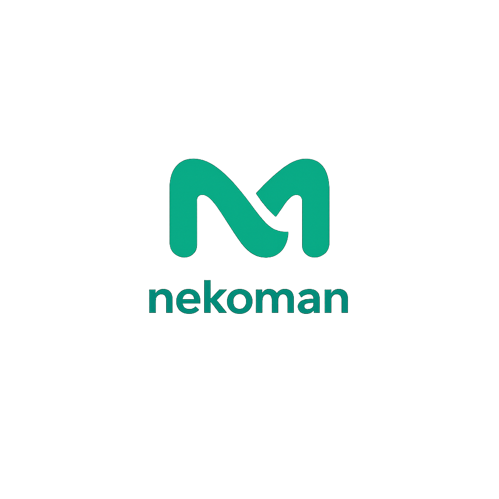

  
  
Building software with intention, not noise.

---

**nekoman** is a software organization focused on building individual, high-quality projects across both open-source and proprietary ecosystems.

We believe in pragmatic engineering, clean architecture, and sharing knowledge where it makes sense—while also delivering production-ready solutions for real-world use cases.

## 🌍 What We Do

- Develop custom, purpose-driven software projects

- Maintain and contribute to open-source libraries and tools

- Build and operate proprietary platforms and products

- Focus on long-term maintainability, scalability, and developer experience

Our projects range from experimental ideas to fully productionized systems.

## 🚆 Main Focus: Trainity

Our primary project is Trainity:

- GitHub: https://github.com/Trainity-net

- Website: https://trainity.net

Trainity is an actively developed platform with a strong focus on:

- Reliability and performance

- Clear APIs and well-structured codebases

- Building the modern fitness plattform of the future

Trainity represents our core engineering philosophy and serves as the foundation for many of our technical decisions and standards.

## 🔓 Open Source & Proprietary

nekoman works in both worlds:

**Open Source**

- Transparent development

- Clean documentation and reproducible builds

**Proprietary**

- Tailored solutions for specific needs

- Strong focus on security and stability

- Built on top of the same engineering principles we apply to open source

## 🤝 Contributing

We welcome contributions to our open-source projects.

If you want to contribute:

**1** - Check the individual repository README

**2** -  Follow the contribution guidelines

**3** - Open an issue or pull request with clear context

For larger ideas or collaborations, feel free to start a discussion.

## 📄 Licensing

Licensing depends on the individual project:

- Open-source projects include their license in the repository

- Proprietary projects are explicitly marked as such

Always check the repository license before using code.

## 📫 Contact

Organization: nekoman

Main Project: Trainity (https://trainity.net)
Email: office@nekoman.at

Further contact details may be provided in individual repositories.
